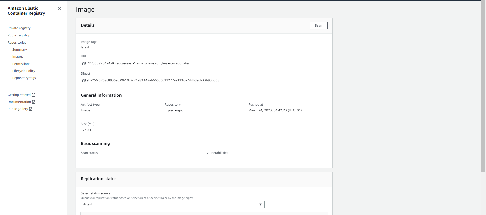
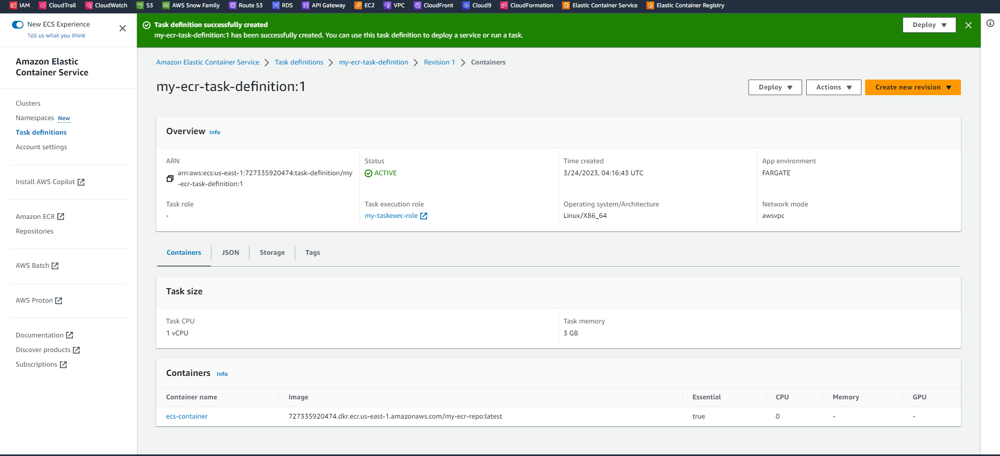

# DEPLOYING A WEB APPLICATION TO AMAZON ECS USING EC2, DOCKER, ECR & LOAD BALANCER

__STEPS__

1. Login to AWS and navigate to EC2 to create an instance, not forgetting to attach a keypair to the instance.   
   
2. Using the __SSH client__ option to connect remotely into the instance.   
   
3. Using Mobaxterm to connect remotely the instance via SSH by specifying public IPV4, username and path to the keypair.   
   
4. SSH is successful and tested using __whoami__ command.   
   
5. Install docker using root priviledges and yum.   
   
6. Docker installation is complete.   
   
7. Start docker using systemctl and ensure it is active.   
   
8. Create and directory and navigate to this directory, create a Dockerfile (a text document that contains all the commands a user could call on the command line to assemble an image) and input the command below using any preferred editor (I used vim editor).   
   
9. Create and edit an index.html file.   
   
10. Build the image using the docker build -t command (. means in the current directory).   
   
11. Build is complete, centos is the base image.   
   
12. Run the commands below to view docker images (docker images) and running containers (docker ps -a).   
   
13. Run app using public DNS.   
   
14. Navigate to ECR on AWS to create a private repo where built image will be pushed to.   
   
15. Create a role for IAM user (with programmatic access) for ECR.   
   
16. Configure credential (access key and secret access key of user) using __aws configure__.   
   
17. Use __push commands__ from ecr repo to push my image to ECR.   
   
18. I had issues continuing as a non-root user while trying to login.   
   
19. I switched to root user using __sudo su__ command and login was successful.   
   
20. Using __docker images__ command to check my images and tagging my image before pushing to ECR.   
   
21. I pushed my image to my private repo on ECR.   
   
22. My image is visible on Amazon ECR (ECR is a registry for images).   
   
23. More details about my image.   
   
24. Create a target group to attach to an application load balancer (notice the target group is not associated to a LB yet).   
   
25. Create an application load balancer (summary of my ALB details).   
   
26. ALB is active with high availability (more than 1 AZ).   
   
27. Create a task execution role that grants the Amazon ECS container and Fargate agents permission to make AWS API calls on our behalf.   
   
28. Create a task definiton that describes the containers that forms our application.  
   
29. Create a cluster which is a group of ECS container instances.   
   
30. Create a service that defines the minimum and maximum task from a task definition.   
   
31. A list of tasks using fargate as launch type (a task is an instance of a task definition).   
   
32. This shows a deployment and events for ECS.   
   
33. Using ALB DNS to view my web app.   
   
34. To avoid being charged, I cleaned up my resources by terminating my instance and deleting other resources.
